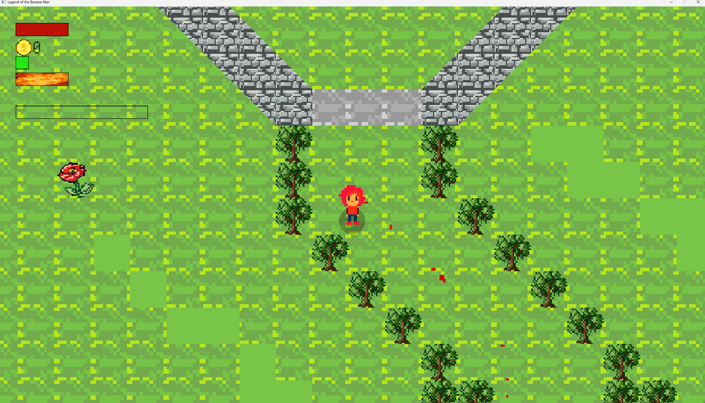
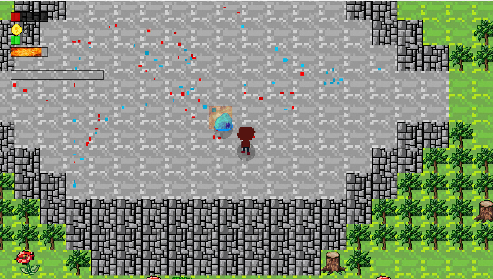
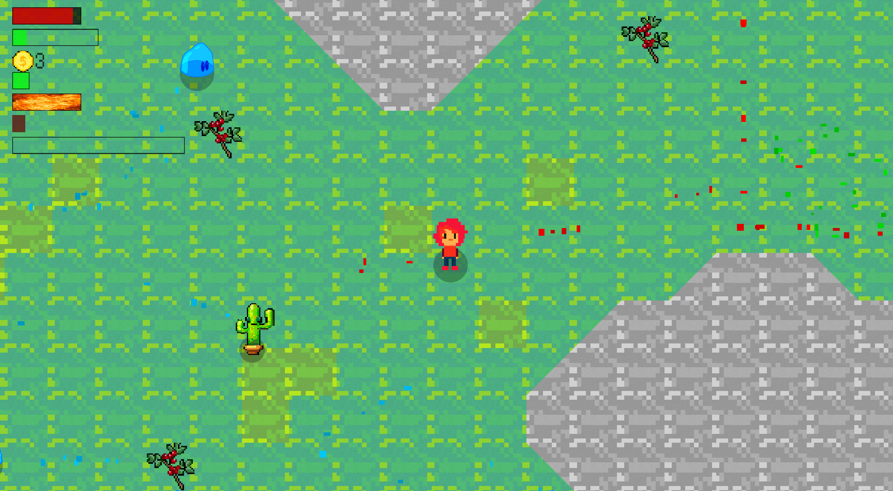

# Legend of the Banana Man
First created simply as 'sdl_test'.

This is an **Action Adventure** game made in pure C++ with SDL.
1. It contains a variety of different enemies.
2. Different levels with differing environments.
3. Collectables, chests and shops.
4. Bosses and an ending.
5. Explosions 🔥 + Particles! 
6. Npc's to talk to.
7.  And most importantly:
#### **A Banana Man**
.

## Cool things I did/learned while making it:

- Wrote a quadtree to store entity references for efficient collision detection
- Made an ingame level editor to quickly be able to test out level ideas
- Made a snake boss by using a double-linked list lol
- Implemented the A* pathfinding algorithm for enemies to find the player
- Used the *Object oriented game development* style, very good learning experience; though kind of restricting
- Discovered the magic of enums. So simple, yet so powerful.

Written completely in Visual Studio, actually a pretty great IDE for C++.
If you want to try the level editor, change the boolean **DEV** in enum.h to true. I have lots of if constexpr's that will conditionally add dev code if that flag is set to true. Enter devmode with 'k'.

| You can download it |
| ----------- |
| at releases,  it's just an exe |
| with some accompanying files; basically. |

**Only for windows currently though**

# Screenshots:

